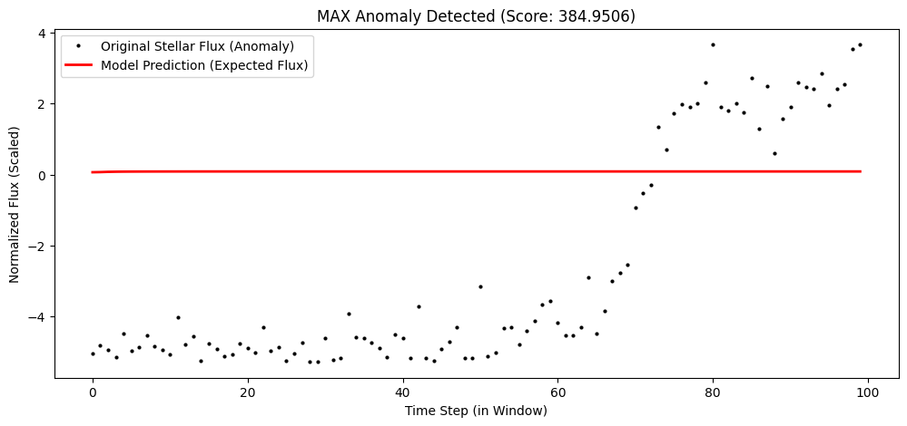
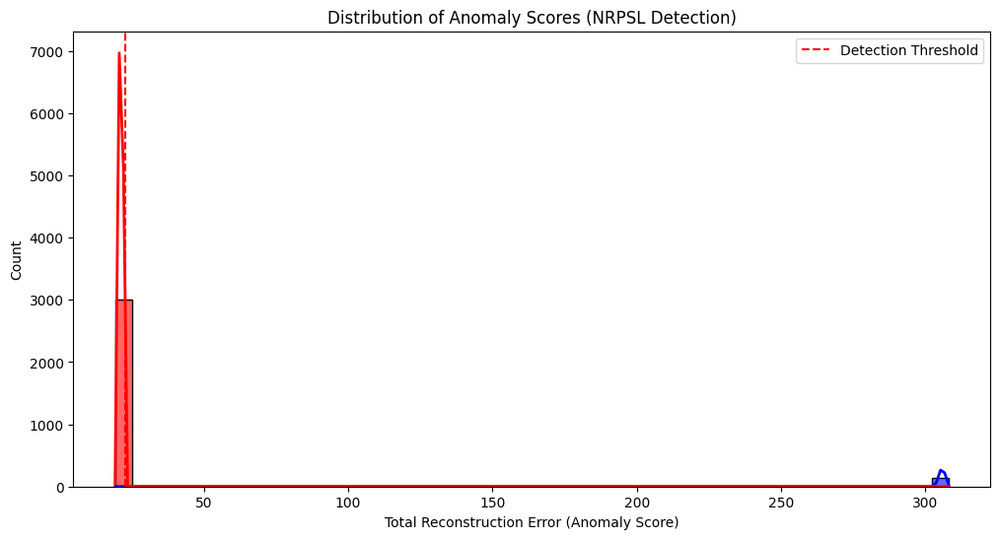

## 🌌 Phase I: Galactic Anomaly Monitor (G-AM)

### Discovery Threshold
The model set a strict 99.5th percentile threshold at 217.1643.

 

### Key Finding: UNPRECEDENTED Stellar Event
The most anomalous sequence detected had a score of 384.9506.

 

---

## 🔬 Phase II: Non-Radiant Power Source Locator (NRPSL)

### Key Finding: 100% Detection Rate
The Multi-Modal Autoencoder successfully separated the anomaly class.

